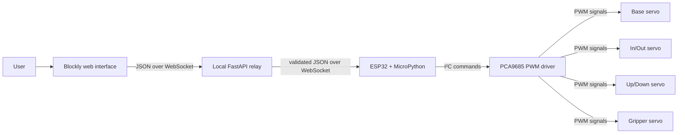
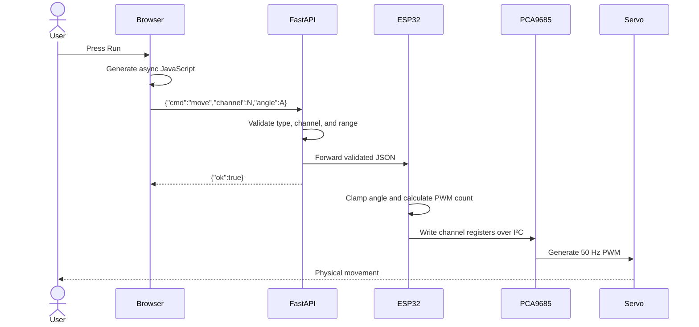

# BlockBot — Complete Project Explanation and Final-Defense Guide

> **Project status:** Functional school-project prototype for supervised, local-network demonstrations. It is intentionally not a production or internet-deployed system.
>
> **Important honesty rule for the defense:** Describe only features that exist in the current prototype. Do not claim that BlockBot is autonomous, AI-powered, cloud-deployed, production-ready, secure for public internet use, or equipped with sensor feedback.

---

## 1. Thirty-second explanation

BlockBot is a prototype educational robotic-arm control system. A user creates a program by dragging Blockly blocks in a web browser. The browser converts those blocks into an ordered sequence of commands. A local FastAPI server validates and relays movement commands through WebSockets to an ESP32. The ESP32 converts the requested joint angles into PWM values, sends them over I²C to a PCA9685 servo driver, and the driver controls four servo channels for the arm. The project demonstrates block-based programming, real-time web communication, embedded control, and basic robotic safety limits without requiring the student to write code manually.

## 2. One-sentence project definition

**BlockBot is a locally hosted, block-programmed robotic-arm prototype that lets a user sequence four servo movements from a browser and sends validated commands to an ESP32 over Wi-Fi.**

## 3. Abstract

Programming and controlling a robotic arm normally requires knowledge of syntax, electronics, networking, and actuator control. That learning curve can prevent beginners from understanding the more important idea: that a robot performs a sequence of precise instructions. BlockBot addresses this problem with a visual, block-based interface.

The user constructs a program with a start block, joint-movement blocks, optional logic or loop blocks, and wait blocks. The browser generates asynchronous JavaScript from the workspace. Each movement is sent as a small JSON message over a WebSocket connection to a local FastAPI application. The backend validates the joint number and requested angle before forwarding the command to the ESP32. The ESP32 runs MicroPython, receives the command through a lightweight Microdot WebSocket server, clamps the angle to the configured safety range, converts the angle to a PCA9685 PWM count, and drives the selected servo.

The result is a complete browser-to-hardware prototype that combines a visual programming environment, a web application, a local relay server, a wireless embedded controller, an I²C PWM driver, and servo motors. Its intended use is a supervised classroom or final-defense demonstration on a trusted local network. Production concerns such as authentication, encrypted communication, remote deployment, telemetry, device provisioning, over-the-air updates, and industrial safety are explicitly outside the current scope.

---

## 4. Problem statement

Beginners can find conventional robot programming difficult because they must learn several concepts at once:

- programming syntax;
- command sequencing;
- web or serial communication;
- microcontroller programming;
- PWM and servo behavior;
- circuit wiring and power requirements; and
- mechanical movement limits.

The project asks: **Can a simple browser-based block interface make a four-servo robotic-arm prototype easier to program while still demonstrating the complete path from a high-level instruction to physical movement?**

BlockBot answers this by separating the system into understandable layers. The user thinks in terms of blocks and angles, while each lower layer performs a specific technical responsibility.

## 5. Project objectives

### 5.1 Main objective

To design and implement a functional prototype that allows a user to create and run a sequence of robotic-arm movements using visual programming blocks in a browser.

### 5.2 Specific objectives

1. Provide a beginner-friendly Blockly interface.
2. Support four independently addressed servo channels.
3. Allow an angle to be selected for each movement.
4. Support timed pauses between movements.
5. Transmit commands in real time through WebSockets.
6. Validate commands before they reach the hardware.
7. Apply a second layer of angle limiting in the firmware.
8. Drive several servos through one PCA9685 board over I²C.
9. Save the browser workspace locally so a program survives a refresh.
10. Demonstrate the full system on a trusted local Wi-Fi network.

## 6. Scope

### Included in the prototype

- a browser-based Blockly editor;
- custom start, movement, and wait blocks;
- standard Blockly logic, loops, mathematics, variables, and functions;
- four logical arm channels;
- ordered program execution;
- a FastAPI health endpoint and browser WebSocket endpoint;
- backend validation of channel and angle values;
- an ESP32 MicroPython WebSocket server;
- PCA9685 control over I²C;
- servo angle clamping in firmware;
- local browser persistence;
- automatic browser reconnection after a connection loss;
- responsive interface styling; and
- automated tests for validation, health, and frontend serving.

### Deliberately outside the prototype

- public internet or cloud deployment;
- Vercel deployment;
- user accounts, authentication, roles, or permissions;
- TLS encryption and device certificates;
- a database or cloud storage;
- remote fleet management and device provisioning;
- over-the-air firmware updates;
- computer vision, machine learning, or artificial intelligence;
- autonomous movement planning;
- inverse kinematics or Cartesian-coordinate control;
- joint-position sensors or closed-loop application feedback;
- collision detection;
- a certified emergency stop;
- industrial safety certification;
- simultaneous collaborative editing;
- production monitoring, audit logging, or analytics; and
- manufacturing or commercialization.

---

## 7. System overview



The design is layered:

| Layer | Main responsibility |
|---|---|
| User interface | Let the user construct and run a program visually. |
| Browser execution | Convert blocks into ordered asynchronous operations. |
| Backend relay | Accept a browser connection, validate movement commands, and forward them. |
| ESP32 firmware | Receive commands, apply hardware-side limits, and operate the servo abstraction. |
| PCA9685 driver | Generate stable PWM output without making the ESP32 time every pulse itself. |
| Mechanical arm | Convert servo shaft movement into arm and gripper movement. |

This separation is useful because a failure can be located by layer. For example, a page-loading problem belongs to the web layer, a rejected angle belongs to validation, a Wi-Fi failure belongs to communication, and an unpowered servo belongs to hardware or power.

---

## 8. Hardware components

| Component | Quantity | Purpose |
|---|---:|---|
| ESP32 development board | 1 | Runs MicroPython, joins Wi-Fi, hosts the device WebSocket, and controls I²C. |
| PCA9685 16-channel PWM board | 1 | Produces stable PWM signals for the servos. Only channels 0–3 are used. |
| MG996R servo | 1 | Intended for the base, where more torque is useful. |
| MG90S servos | 3 | Intended for the other arm joints and gripper. |
| Separate regulated 5 V supply | 1 | Supplies servo power without drawing high current through the ESP32. |
| Jumper wires | As needed | Carry logic, I²C, ground, and power connections. |
| Robotic-arm structure | 1 | Holds the servos and converts rotation to arm motion. |
| Computer | 1 | Runs the local FastAPI server and browser. |
| Wi-Fi network/hotspot | 1 | Places the computer and ESP32 on the same trusted network. |
| KY-023 joystick modules | 2, optional | Used only by the separate joystick test utility. They are not needed for the normal Blockly demo. |

### 8.1 Why the PCA9685 is used

The ESP32 can generate PWM itself, but controlling several servos while also handling Wi-Fi and a WebSocket server is easier and more stable with a dedicated PWM controller. The PCA9685:

- supports up to 16 PWM channels;
- is controlled with only the SDA and SCL I²C lines;
- continuously generates PWM after its registers are set; and
- keeps pulse generation separate from network and application processing.

BlockBot uses four of its sixteen channels, leaving unused channels for possible future expansion.

### 8.2 Wiring

#### ESP32 to PCA9685 logic connection

| ESP32 | PCA9685 | Meaning |
|---|---|---|
| 3.3 V | VCC | Logic supply |
| GND | GND | Common reference ground |
| GPIO 21 | SDA | I²C data |
| GPIO 22 | SCL | I²C clock |

The firmware creates I²C bus 0 with SDA on GPIO 21, SCL on GPIO 22, and a bus speed of 400 kHz.

#### Servo channel mapping

| PCA9685 channel | UI label | Numerical channel | Backend/firmware safe angle |
|---:|---|---:|---:|
| 0 | Base | 0 | 0°–180° |
| 1 | In / Out | 1 | 65°–125° |
| 2 | Up / Down | 2 | 30°–120° |
| 3 | Gripper | 3 | 90°–150° |

### 8.3 Power design and the common-ground rule

Servos can draw large and rapidly changing current, especially when starting, carrying a load, or stalling. They must not be powered from the ESP32’s 3.3 V pin. The intended arrangement is:

- power the ESP32 by USB;
- power the servo rail with a suitable regulated 5 V supply; and
- connect the ESP32 ground, PCA9685 ground, and servo-supply ground together.

The grounds must be common because a PWM signal is a voltage measured relative to ground. Without the same ground reference, a servo can interpret the control signal incorrectly or behave unpredictably.

The supply must be chosen for the combined current of the actual servos under load. The project repository does not contain a measured peak-current result, so a precise current requirement must not be invented during the defense. Measure it or use the manufacturers’ datasheets for the exact servo variants before stating a number.

### 8.4 Physical safety

- Start testing without a payload.
- Keep fingers, hair, wires, and loose clothing away from the moving mechanism.
- Test one joint at a time after assembly.
- Verify the mechanical direction before commanding an extreme angle.
- Do not leave a stalled servo powered; it can heat up and draw high current.
- Keep the power-disconnect point easy to reach.
- Treat the software angle limits as prototype safeguards, not certified safety controls.

---

## 9. Software components and technologies

| Technology | Where it is used | Reason for selection |
|---|---|---|
| HTML | Frontend structure | Simple browser compatibility. |
| CSS | Frontend presentation | Responsive layout, brand styling, focus states, status indicators, and toast messages. |
| JavaScript | Browser behavior | Blockly integration, WebSocket communication, saving, and program execution. |
| Blockly 11.2.2 | Visual editor | Lets beginners program with connected blocks rather than typed syntax. |
| Python | Backend | Clear implementation and strong support for web APIs. |
| FastAPI 0.138.2 | Local backend | Provides HTTP routes, WebSockets, JSON handling, and static-file serving. |
| Uvicorn 0.49.0 | ASGI server | Runs the FastAPI application locally. |
| websockets 16.0 | Backend-to-ESP32 link | Creates the outbound WebSocket connection from the backend. |
| MicroPython | ESP32 firmware | Python-like embedded development on the ESP32. |
| Microdot 2.6.2 | ESP32 web framework | Lightweight HTTP/WebSocket handling suitable for MicroPython. |
| JSON | Command format | Human-readable and supported on all three software layers. |
| WebSocket | Live communication | Maintains a two-way connection and avoids a new HTTP request for every movement. |
| I²C | ESP32-to-PCA9685 bus | Two-wire control for the PWM board. |
| localStorage | Browser program storage | Saves the Blockly workspace without a database. |

The project pins its desktop Python dependencies in `requirements.txt`. Blockly is loaded from a CDN with an explicit version number. Because Blockly is loaded from the internet, the first page load needs access to that CDN unless the assets are already cached. Fully offline use would require storing the Blockly files inside the project.

---

## 10. Exact end-to-end operation

### 10.1 Startup sequence

1. The servo supply, PCA9685, ESP32, and arm are connected correctly.
2. The ESP32 starts `firmware/main.py`.
3. The firmware disables and re-enables station-mode Wi-Fi, then connects with the credentials in `config.py`.
4. After Wi-Fi connects, the ESP32 prints its IP address.
5. The firmware imports the larger application modules after Wi-Fi initialization. This ordering helps Wi-Fi allocate receive buffers before the MicroPython heap becomes more fragmented.
6. The ESP32 creates an `Arm` object.
7. `Arm` initializes I²C bus 0 at 400 kHz.
8. The PCA9685 is initialized at I²C address `0x40` and configured for 50 Hz PWM.
9. Microdot starts an HTTP/WebSocket server on `0.0.0.0:8080`.
10. On the computer, the FastAPI application is started with the ESP32 WebSocket address in `ARM_WS`.
11. FastAPI serves the frontend at the root URL, normally `http://localhost:8000`.
12. The browser loads Blockly and attempts to connect to the FastAPI `/ws` endpoint.
13. For that browser session, FastAPI opens a corresponding outbound WebSocket to the ESP32.
14. The status changes from disconnected/connecting to connected, and the Run button becomes available.

### 10.2 Program construction

The user drags a `when run` block into the workspace and attaches movement or control blocks below it. A movement block contains:

- a joint dropdown; and
- an angle number input.

The custom wait block contains a number of seconds between 0 and 10. Standard Blockly blocks can be used for loops, logic, mathematics, variables, and functions.

### 10.3 Program execution

1. The user presses **Run**.
2. The browser finds top-level `when run` blocks.
3. If no start block exists, the browser displays an error and does not execute orphan blocks.
4. For every start block, Blockly generates JavaScript from the attached block sequence.
5. The browser builds an asynchronous function whose permitted helper arguments are `moveJoint` and `wait`.
6. A movement block generates `await moveJoint(channel, angle)`.
7. A wait block generates `await wait(seconds)`.
8. Start sequences are run one after another, not in parallel.
9. The Run button is disabled while execution is active, preventing a second simultaneous run from the same page.

### 10.4 Movement command path



The backend acknowledgment means that the command passed backend validation and was sent to the ESP32 WebSocket. It does **not** prove that the physical servo reached the requested position. There is no position sensor returning a measured joint angle.

### 10.5 Wait behavior

In the normal Blockly workflow, waiting happens in the browser with JavaScript’s timer. A wait block does not travel through the backend. For example, a two-second wait delays the browser before it sends the next movement command.

The ESP32 firmware also understands a direct command with `"cmd":"wait"` and a `"second"` field, but the current FastAPI relay only accepts `move`. Therefore, firmware-side wait support is not used by the normal frontend path. If asked, explain that this is leftover/direct-client capability rather than the implementation used by Blockly.

---

## 11. Frontend in detail

### 11.1 Main interface

The page has:

- the BlockBot logo and project identity;
- a live connection-status indicator;
- a **New** button;
- a **Run** button;
- a Blockly workspace;
- a first-use quick-start coach; and
- toast notifications for success and error feedback.

The logo is an SVG, which allows it to remain sharp at different display sizes. A cropped SVG is also used as the browser favicon.

### 11.2 Custom blocks

| Block | Color/function | Generated behavior |
|---|---|---|
| `when run` | Orange event/start block | Identifies an executable top-level sequence. |
| `move joint` | Blue command block | Calls `moveJoint(channel, angle)` and waits for its result. |
| `wait` | Green timing block | Calls a local asynchronous timer. |

The movement block’s editor permits a general 0°–180° number range, while the backend applies narrower per-joint limits where required. This keeps one simple block UI while protecting the actual arm based on the selected channel.

### 11.3 Standard blocks

The toolbox also exposes Blockly categories for logic, loops, mathematics, variables, and functions. This means a program can repeat a movement, calculate an angle, or organize instructions into a function. BlockBot does not add robot sensor-value blocks, so logic operates on values created in the block program rather than real-time physical feedback.

### 11.4 Generated code

Example visual intent:

1. when run;
2. move the base to 90°;
3. wait 1 second; and
4. move the gripper to 120°.

Conceptually generates:

```javascript
await moveJoint(0, 90);
await wait(1);
await moveJoint(3, 120);
```

The use of `await` makes execution sequential. The next instruction begins only after the current helper completes. For movement, completion means receiving a backend response, not measuring mechanical completion.

### 11.5 WebSocket connection logic

- If the page is served with HTTP, the browser uses `ws://`.
- If the page is served with HTTPS, it uses `wss://`.
- When the page is served by FastAPI, it connects to the same host at `/ws`.
- A development exception supports a page opened through common port 5500 by targeting port 8000 for the backend.
- If disconnected unexpectedly, reconnect attempts use delays of 1, 2, 4, and then 8 seconds, remaining capped at 8 seconds.
- When disconnected, Run is disabled.

Only one command reply is pending at a time. This matches the sequential `await` design and prevents overlapping movement requests from the same page.

### 11.6 Saving and reset

Blockly serialization converts the workspace into data that is stored under the browser key `blockbot`. Non-interface changes trigger an automatic save. On the next load, the workspace is restored.

If the saved data is damaged or cannot be loaded, the application clears it, inserts the starter program, and displays a message. The **New** button asks for confirmation, clears the workspace, inserts the starter blocks, and saves the new state.

The storage is local to that browser profile and device. It is not synchronized to another computer and is not stored on the backend.

### 11.7 Responsive and accessibility features

- The layout adapts at tablet and phone widths.
- Buttons are designed with practical touch target sizes.
- Keyboard focus has a visible outline.
- Status updates use an ARIA live region.
- Toast notifications use an alert role.
- Images have alternative text.
- Motion is reduced when the operating system requests reduced motion.
- On narrow screens, some status text is visually hidden while remaining available to assistive technology.

One accessibility tradeoff is that the HTML viewport disables user scaling. That helps preserve the editor layout but can make zoom-based accessibility harder. A production-quality redesign should allow zoom and adapt the workspace around it.

### 11.8 Browser execution limitation

The generated Blockly source is executed with the JavaScript `AsyncFunction` constructor. This is acceptable for a supervised prototype where the user only constructs trusted blocks supplied by the page. It is not an appropriate security boundary for untrusted programs or a public multi-user service. A production design should interpret a restricted command model or execute a validated abstract syntax tree instead of dynamically running generated source.

---

## 12. Backend in detail

### 12.1 Responsibilities

The FastAPI application has four main responsibilities:

1. serve the frontend files;
2. expose a simple health endpoint;
3. accept a WebSocket from the browser; and
4. validate and relay movement commands to the ESP32.

### 12.2 Configuration

The ESP32 WebSocket address comes from the `ARM_WS` environment variable. If it is absent, the application uses the repository’s default development address:

```text
ws://192.168.1.198:8080/ws
```

Using an environment variable prevents the ESP32 IP from being hard-coded into browser code and makes the relay reusable when the device address changes.

### 12.3 HTTP health endpoint

Request:

```http
GET /health
```

Response:

```json
{"status":"ok"}
```

This proves that the FastAPI process is responding. It does not prove that the ESP32 or servos are connected.

The ESP32 separately exposes its own `/health` endpoint on port 8080. That endpoint reports device-server availability, but it still does not prove physical servo movement.

### 12.4 Browser WebSocket endpoint

The browser connects to:

```text
/ws
```

The backend accepts the browser and tries to connect to the ESP32 with a five-second opening timeout. If the device cannot be reached, the backend sends an error object to the browser and closes the session.

### 12.5 Validation rules

The backend accepts only a JSON object whose command is `move`. Validation checks are exact:

- the channel must be an integer;
- a Boolean is explicitly rejected even though Python normally treats `bool` as a subclass of `int`;
- the channel must be one of 0, 1, 2, or 3;
- the angle must be an integer or floating-point number;
- a Boolean angle is rejected; and
- the angle must be inside the inclusive safe range for its channel.

The validator uses the same normal operating limits as `firmware/servo.py`:

```text
0: 0–180
1: 65–125
2: 30–120
3: 90–150
```

An invalid command is rejected and is not forwarded.

### 12.6 Command and reply examples

Valid request:

```json
{"cmd":"move","channel":0,"angle":90}
```

Valid backend response:

```json
{"ok":true}
```

Examples of invalid requests:

```json
{"cmd":"move","channel":8,"angle":90}
{"cmd":"move","channel":1,"angle":20}
{"cmd":"wait","second":2}
{"cmd":"move","channel":"0","angle":90}
```

The response to an invalid request contains `"ok": false` and a human-readable error. An ESP32 connection failure also produces an error response.

### 12.7 Logging

The backend keeps a bounded in-memory deque with at most 100 sent commands. Bounded storage prevents unlimited growth. The current prototype does not expose that log through an API or save it to disk, so it is an internal development feature rather than a user-visible history or production audit log.

### 12.8 Why a local backend is used

A browser could theoretically connect directly to the ESP32, but the backend adds:

- centralized validation;
- one place to configure the device address;
- static frontend hosting;
- clearer separation between UI and hardware; and
- a path for future logging or authentication.

It also avoids trying to expose the ESP32 to the public internet. For this prototype, the computer, browser, and ESP32 remain on one trusted local network.

---

## 13. Firmware in detail

### 13.1 Configuration file

`firmware/config.example.py` contains placeholder Wi-Fi values. For use on a real device, it is copied to `config.py` and the local SSID and password are filled in. `config.py` is ignored by version control so credentials are not intentionally committed.

### 13.2 Wi-Fi initialization

The ESP32 uses station mode, meaning it joins an existing Wi-Fi network rather than creating one. The firmware waits until the device reports a connection and then prints the assigned IP address.

The current connection loop has no timeout. If credentials are wrong or the access point is unavailable, startup can wait indefinitely. This is acceptable for a supervised prototype because the serial console makes the problem visible, but a more robust version needs a timeout, retry policy, and status indication.

### 13.3 Device endpoints

The Microdot application listens on all ESP32 interfaces on port 8080:

- `GET /health` returns a device status; and
- WebSocket `/ws` receives command messages.

The firmware parses each WebSocket message as JSON. It handles `move` and also contains a direct `wait` branch. Errors are printed to the serial console.

### 13.4 Servo abstraction

The `Arm` class hides I²C and PWM details from the WebSocket handler. The handler only needs to call:

```python
arm.move(channel, angle)
```

Inside `move`:

1. the safe range for the channel is selected;
2. the angle is clamped to that range;
3. the angle is mapped linearly to a PWM count; and
4. that count is written to the selected PCA9685 channel.

Clamping is a second safety layer. The backend should already reject an unsafe angle, but the firmware does not rely entirely on the computer-side check.

### 13.5 Angle-to-PWM calculation

The configured count range is:

```text
MIN_PULSE = 110 counts
MAX_PULSE = 500 counts
```

The calculation is equivalent to:

```text
pulse_count = 110 + integer_part((500 - 110) × angle / 180)
```

Example for 90°:

```text
pulse_count = 110 + integer_part(390 × 90 / 180)
            = 110 + 195
            = 305 counts
```

These values are PCA9685 counts, **not microseconds**. At 50 Hz:

- one PWM period is 20,000 microseconds;
- the PCA9685 divides it into 4,096 counts;
- one count is approximately 4.8828 microseconds;
- 110 counts is approximately 537 microseconds; and
- 500 counts is approximately 2,441 microseconds.

The selected range must be calibrated for the actual servos and mechanics. Different servo models and arm assemblies can require different pulse and angle limits.

### 13.6 PCA9685 frequency calculation

The driver calculates the prescale value from the PCA9685’s nominal 25 MHz oscillator:

```text
prescale = round(25,000,000 / (4096 × frequency)) - 1
```

For a requested servo frequency of 50 Hz, this is approximately 121. The driver temporarily puts the PCA9685 into sleep mode, writes the prescale register, restores the prior mode, waits briefly, and enables restart/auto-increment behavior.

### 13.7 Channel register write

Each PCA9685 channel has four LED timing bytes beginning at register `0x06`, with four bytes per channel. The driver sets the on-count to zero and writes the 12-bit off-count as low and high bytes. The board then repeats that timing value at the configured frequency.

### 13.8 Firmware recovery behavior

If the Microdot application exits with an `OSError`, the firmware performs an ESP32 reset. This provides a simple prototype recovery path for certain network failures. It is not a complete watchdog or production fault-recovery system.

### 13.9 Optional joystick test utility

`firmware/joystick_test.py` is a separate hardware-testing mode, not part of the normal web-control path. It reads four ADC axes from two optional KY-023 joystick modules:

- GPIO 34;
- GPIO 35;
- GPIO 32; and
- GPIO 33.

It assumes an approximate ADC center of 2048, applies a dead zone of 300, limits the movement change to about 3 degrees per 50 ms iteration, and prints status every ten iterations. Channel 1 is inverted to match the intended physical direction.

There is a known inconsistency: this utility currently defines limits of `0–180`, `25–125`, `50–140`, and `93–150`, while the primary backend and servo code use `0–180`, `65–125`, `30–120`, and `90–150`. The `Arm` class still clamps the actual output to its primary ranges, but the joystick utility’s internal/displayed angle can differ from the commanded physical limit. For a defense, describe the joystick file as an optional calibration utility with ranges that still need synchronization; do not claim its table matches the main application.

---

## 14. Data flow and protocol

### 14.1 Transport choice

WebSocket is used because it creates a persistent, two-way connection. Compared with repeated polling, it has lower command overhead and allows immediate status/error replies. HTTP is still used for page files and health checks.

### 14.2 JSON schema used by the main path

The effective movement message is:

```json
{
  "cmd": "move",
  "channel": 0,
  "angle": 90
}
```

| Field | Type | Meaning |
|---|---|---|
| `cmd` | string | Must be `move` in the browser-to-backend path. |
| `channel` | integer | Servo selection from 0 through 3. |
| `angle` | integer or float | Requested angle, subject to that channel’s safe range. |

### 14.3 Ordering

The browser awaits one reply before moving to the next generated instruction. This creates predictable sequential command submission from one page. It does not guarantee that the physical servo has completed its rotation before the next command is sent, because the acknowledgment occurs at relay time and the servos do not report completion.

If mechanical settling is needed, the Blockly program must add a wait block after a movement. The delay is chosen by the user and is not automatically calculated from servo speed, angle difference, or load.

### 14.4 Failure behavior

| Failure | Current behavior |
|---|---|
| Browser cannot reach FastAPI | Status shows disconnected; Run is disabled; reconnection is attempted. |
| FastAPI cannot reach ESP32 | Browser receives a readable error and the session closes. |
| Invalid channel or angle | Backend rejects the command and does not forward it. |
| Browser WebSocket drops | Pending command is rejected and reconnection begins. |
| ESP32 application raises certain network `OSError`s | Firmware resets the ESP32. |
| Saved Blockly data is corrupt | Data is cleared and a starter workspace is restored. |
| Servo has no power/common ground | Software may appear connected, but hardware will not move correctly. |
| Servo is blocked mechanically | No automatic detection; power must be removed manually if necessary. |

There is no application-level command ID, retry, delivery deduplication, or hardware-completion response. A production protocol would add those features.

---

## 15. Safety and validation strategy

BlockBot uses multiple prototype-level safeguards:

1. **UI input range:** the angle block is limited to a general 0°–180° range.
2. **Backend allowlist:** only channels 0–3 are valid.
3. **Backend per-channel limits:** unsafe values are rejected before forwarding.
4. **Firmware clamping:** normal known channels are clamped again before PWM conversion.
5. **Sequential browser execution:** only one reply is pending from a page.
6. **Run-button lockout:** the same page cannot start a second program while one is running.
7. **Separate servo supply:** high servo current does not pass through the ESP32 logic rail.
8. **Supervised local operation:** the prototype is not exposed to arbitrary internet clients.

These measures reduce mistakes, but they do not form a certified safety system. Important missing safety features include a hardware emergency stop, current sensing, position feedback, collision sensing, motion-speed planning, and a fail-safe neutral or torque-off state after communication loss.

### Defense-in-depth explanation

Backend validation and firmware clamping are intentionally redundant. Network-facing software can reject bad input early and return a helpful message. Firmware clamping remains useful because hardware protection should not depend entirely on a separate computer process. Redundancy is appropriate when software ultimately causes physical movement.

---

## 16. Testing and verification

### 16.1 Automated tests currently present

The repository uses Python’s `unittest` framework. The current suite contains six tests covering:

- acceptance of a safe channel/angle pair;
- rejection of angles outside the allowed range;
- rejection of a string angle;
- rejection of a Boolean channel;
- the FastAPI health response; and
- frontend serving at the root route.

The frontend test confirms that the root page is available and contains the BlockBot identity.

### 16.2 What automated tests prove

They provide repeatable evidence that important input rules and basic server routes work. They help detect regressions if validator or routing code changes.

### 16.3 What automated tests do not prove

The suite does not currently test:

- a real ESP32 connection;
- WebSocket forwarding end to end;
- PCA9685 register output on hardware;
- actual joint angles;
- servo torque or payload;
- browser behavior through an end-to-end browser test;
- reconnection under real packet loss;
- concurrent browser clients;
- long-duration reliability; or
- physical safety.

Those require integration tests, hardware-in-the-loop tests, measurement tools, or supervised manual testing.

### 16.4 Recommended manual verification sequence

1. Inspect all power and ground connections with power off.
2. Disconnect the mechanical load or put the arm in a safe pose.
3. Power the ESP32 and observe the serial console.
4. Confirm that an IP address is printed.
5. Open the ESP32 `/health` endpoint.
6. Start FastAPI with the correct `ARM_WS` address.
7. Open the FastAPI `/health` endpoint.
8. Load the page and confirm **Connected**.
9. Run one conservative midpoint movement on channel 0.
10. Repeat for each channel, using its safe midpoint.
11. Test a short sequence with a visible wait.
12. Test a loop with a small repetition count.
13. Refresh the page and verify workspace restoration.
14. Temporarily stop the ESP32 or disconnect Wi-Fi and verify the UI error state.
15. Restore the connection and confirm reconnection.

### 16.5 Evidence to collect before the defense

Record values rather than estimating them:

- test-suite result and date;
- average command-to-visible-motion latency over several trials;
- reconnect time after a planned disconnect;
- maximum demonstrated payload;
- power-supply rating and measured current if available;
- run duration without a reset;
- arm dimensions and total weight; and
- total project cost with receipts or a bill of materials.

If these are not measured, say, “That value was not measured in the current prototype,” then explain how you would measure it. This is stronger than inventing a result.

---

## 17. How to run the prototype locally

### 17.1 Prepare the firmware

1. Install compatible MicroPython firmware on the ESP32.
2. Copy `firmware/config.example.py` to `firmware/config.py`.
3. Enter the local Wi-Fi SSID and password in `config.py`.
4. Upload the required firmware files and the vendored `microdot` folder to the ESP32.
5. Reset the board.
6. Read the assigned IP from the serial output.

### 17.2 Prepare the computer application

From the project directory:

```bash
python3 -m venv .venv
source .venv/bin/activate
python -m pip install -r requirements.txt
```

Start the local server with the ESP32 address:

```bash
ARM_WS=ws://ESP32_IP_ADDRESS:8080/ws uvicorn backend.main:app --reload
```

Open:

```text
http://localhost:8000
```

The browser and computer do not have to be separate devices. For a tablet demonstration, the tablet can open the computer’s LAN address, provided the tablet, computer, and ESP32 are on the same network and the computer firewall permits port 8000.

### 17.3 Run automated tests

With the environment active:

```bash
python -m unittest discover -s tests -v
```

### 17.4 Why this is called a prototype rather than a deployment

The application is run for a supervised demonstration on local hardware. It has not been configured as a continuously operated public service. The ESP32 is reachable only on the local network, the server is started manually, and production security/operations features are intentionally absent. This matches the project’s prototype scope while still demonstrating a complete working system.

---

## 18. Demonstration plan for the committee

### Before entering the room

- Charge the laptop and any portable hotspot.
- Confirm the servo power supply and cable ratings.
- Use a known Wi-Fi network or personal hotspot whose credentials are already configured.
- Record the ESP32 IP address.
- Run the automated tests and save a screenshot.
- Test all joints with conservative angles.
- Prepare a short screen recording as backup evidence, while clearly stating if the live hardware is unavailable.
- Keep an offline copy of the code and this guide.
- If internet availability is uncertain, locally host Blockly before the defense; the current CDN dependency can otherwise prevent the editor from loading.

### Suggested live program

Use a short, safe program that visibly demonstrates sequence and timing:

1. `when run`;
2. base to a safe center angle;
3. wait 1 second;
4. in/out joint to a conservative position;
5. wait 1 second;
6. gripper to a safe open/closed position; and
7. return to the starting pose.

Do not use extreme angles or an untested payload during the defense.

### Suggested 8–10 minute presentation order

1. **Problem and motivation — 1 minute:** Programming robots has a high entry barrier for beginners.
2. **Proposed solution — 1 minute:** Explain Blockly and the browser-to-arm concept.
3. **Architecture — 2 minutes:** Browser, FastAPI, ESP32, PCA9685, servos.
4. **Implementation — 2 minutes:** JSON/WebSocket flow, validation, firmware clamping, PWM conversion.
5. **Live demo — 2 minutes:** Build and run a short sequence.
6. **Testing and limitations — 1 minute:** State what was verified and what remains prototype-only.
7. **Conclusion and future work — 1 minute:** Summarize learning and realistic next steps.

### If the live demo fails

Diagnose by layers:

1. Is the page loaded?
2. Does `http://localhost:8000/health` respond?
3. Does the ESP32 health URL respond?
4. Does the browser show Connected?
5. Is `ARM_WS` using the current ESP32 IP?
6. Is the servo supply on?
7. Are all grounds common?
8. Is the correct PCA9685 channel connected?

Explain the failure transparently. A well-structured diagnosis can itself demonstrate technical understanding.

---

## 19. Design choices and tradeoffs

### Why Blockly instead of a text editor?

Blockly reduces syntax errors and makes the sequence visible. Its tradeoff is less direct control than handwritten code and a dependency on a substantial browser library.

### Why a browser interface?

A browser works across laptops and tablets without installing a custom application. The tradeoff is reliance on browser behavior, frontend assets, and network connectivity.

### Why FastAPI between the browser and ESP32?

It centralizes validation and device configuration and provides a place for future security or logging. The tradeoff is an additional process and failure point.

### Why WebSockets instead of REST commands?

WebSockets keep one low-overhead connection open and support immediate replies. REST would be simpler to inspect but would create a separate request for every instruction.

### Why JSON?

JSON is readable, easy to debug, and supported in JavaScript, Python, and MicroPython. It is larger and slower to parse than a compact binary protocol, but that overhead is negligible for a small supervised command stream.

### Why MicroPython?

It speeds development and keeps backend and firmware languages conceptually similar. Native C/C++ could provide tighter timing and memory control, but the PCA9685 handles pulse generation, so MicroPython is sufficient for this prototype.

### Why localStorage instead of a database?

It provides persistence with no account, server schema, or deployment. The tradeoff is that programs remain on one browser and can be erased with browser data.

### Why open-loop angle control?

Standard hobby servos contain an internal position-control mechanism, so the application can request a pulse associated with an angle without implementing a motor controller. However, the application receives no independent joint measurement, so it cannot confirm the real arm pose, detect an obstruction, or correct mechanical error.

### Why per-joint limits?

The physical geometry differs by joint. A full 0°–180° request might be reasonable for a disconnected test servo but could make an assembled link collide or overextend. Per-joint limits encode conservative knowledge of the prototype’s mechanics.

---

## 20. Current limitations and known technical debt

This section is especially important in a final defense. Recognizing limits demonstrates engineering judgment.

1. **No physical feedback:** A successful response confirms relay, not achieved position.
2. **No emergency stop:** There is no certified hardware E-stop or software cancellation button.
3. **No command cancellation:** Once a generated sequence is running, there is no clean stop control in the current UI.
4. **No automatic settling model:** The user must insert waits; servo completion is not measured.
5. **No authentication or encryption:** WebSockets are plain `ws://` on a trusted LAN.
6. **No production deployment:** The server is manually run and the ESP32 remains local.
7. **No device discovery:** The ESP32 IP must be read and passed in `ARM_WS`.
8. **No Wi-Fi timeout in firmware:** Incorrect credentials can leave startup waiting indefinitely.
9. **No persistent backend log:** The 100-command log is memory-only and not exposed.
10. **No database or program accounts:** Workspace data is one-browser localStorage.
11. **No hardware-in-the-loop automated suite:** Most physical behavior is manually verified.
12. **No command IDs or deduplication:** The protocol is intentionally simple.
13. **No measured reliability or timing claims in the repository:** Those values must be experimentally collected.
14. **CDN dependency:** Blockly assets are not currently bundled for fully offline use.
15. **Dynamic generated-code execution:** Appropriate only for trusted local block programs.
16. **Multiple-client behavior is not designed as a coordination system:** Separate browser sessions could compete for one arm.
17. **Joystick limit mismatch:** The optional test utility’s angle tables differ from the primary limits.
18. **Direct firmware input is less strictly validated:** Normal commands are protected by the backend, but a direct client can bypass that layer. Unknown channels are not explicitly rejected by `Arm.move`; they receive a default 0°–180° range before being passed to the driver. A future version should enforce the same channel allowlist in firmware.
19. **Malformed direct firmware commands can end a connection:** The main normal path sends well-formed data, but the firmware parser should validate keys and types more carefully.
20. **Accessibility tradeoff:** Browser zoom is disabled by the viewport configuration.

### How to discuss a limitation

Use this three-part pattern:

1. state the limitation plainly;
2. explain why it is acceptable within the prototype scope; and
3. identify the concrete improvement needed for a later version.

Example: “The application does not verify the physical angle because the prototype has no independent joint sensors. For a supervised educational demonstration, visual inspection is sufficient. A future version would add encoders or potentiometer feedback and report measured positions to the UI.”

---

## 21. Future improvements in priority order

### Priority 1 — safer prototype operation

- add a physical emergency-stop/power-cutoff switch;
- add a visible software Stop button with cancellable program execution;
- reject unknown channels and malformed data in firmware;
- synchronize all joint-limit definitions;
- add controlled startup/home positions;
- add configurable movement speed and acceleration;
- add servo-current or stall monitoring; and
- define behavior after communication loss.

### Priority 2 — stronger reliability and testing

- add command IDs and device acknowledgments;
- acknowledge completion only after an appropriate movement model or sensor result;
- add WebSocket integration tests with a simulated ESP32;
- add hardware-in-the-loop tests;
- add Wi-Fi connection timeouts and backoff;
- add a watchdog and structured device status;
- bundle Blockly locally for offline demonstrations; and
- add diagnostics for I²C and power problems.

### Priority 3 — better user experience

- add named program save/load/export/import;
- add a block-program stop/pause/step mode;
- show the current commanded pose;
- add block-level highlighting during execution;
- restore browser zoom accessibility;
- provide calibration screens; and
- provide a mobile-optimized control layout.

### Priority 4 — only if moving beyond a school prototype

- device identity and secure provisioning;
- TLS and authenticated sessions;
- signed firmware and over-the-air updates;
- persistent audit logs and monitoring;
- user roles and access control;
- managed device configuration;
- conflict control for multiple users;
- a formally defined protocol and versioning;
- secure secrets storage; and
- a production safety and threat assessment.

---

## 22. Likely committee questions and model answers

### Project concept

**1. What is BlockBot?**  
BlockBot is a locally operated educational robotic-arm prototype. It lets a user build a movement sequence with Blockly blocks and sends validated commands through FastAPI and an ESP32 to four servos.

**2. What problem does it solve?**  
It reduces the programming barrier for beginners. The user can focus on instruction order, angles, loops, and timing without first mastering text syntax and low-level actuator control.

**3. Who is the target user?**  
The current target is a beginner or student using the arm under supervision in a classroom or demonstration environment.

**4. What is the main contribution?**  
The contribution is the integration of visual programming, real-time web communication, validation, embedded firmware, and physical servo control into one understandable prototype.

**5. Is it an industrial robot?**  
No. It is a school-project prototype. It lacks industrial safety systems, certified control hardware, feedback, reliability validation, and production security.

**6. Is it autonomous or AI-based?**  
No. It executes explicit user-created instructions. It does not learn, perceive its environment, or make autonomous decisions.

### Architecture and communication

**7. Explain the architecture from start to finish.**  
The browser turns blocks into asynchronous JavaScript. Movement helpers send JSON through a browser WebSocket to FastAPI. FastAPI validates and forwards the command through another WebSocket to the ESP32. The ESP32 clamps and maps the angle, writes the PCA9685 over I²C, and the PCA9685 generates PWM for the servo.

**8. Why are there two WebSocket connections?**  
One connects the user interface to the local backend, and the second connects the backend to the embedded device. The separation lets the backend validate commands and hide device addressing from the frontend.

**9. Why not connect the browser directly to the ESP32?**  
Direct control would remove a layer, but it would also move validation and device configuration into every client. The backend creates a controlled boundary and leaves room for future logging and access control.

**10. Why WebSocket rather than normal HTTP?**  
WebSocket maintains a persistent two-way connection, allowing low-overhead sequential commands and immediate responses. HTTP remains useful for loading the page and checking health.

**11. Why use JSON?**  
It is human-readable and natively supported in the browser, Python backend, and MicroPython firmware, which simplifies debugging and integration.

**12. What happens if an invalid command is sent?**  
The backend returns an error and does not forward it. For normal known channels, firmware also clamps angles as a second layer.

**13. Does `ok: true` mean the arm reached its angle?**  
No. It means the backend validated and sent the command to the ESP32 connection. The prototype has no joint sensor to verify physical completion.

**14. What happens if Wi-Fi disconnects?**  
The browser shows a disconnected state and attempts reconnection with increasing delays. A pending command fails. Some firmware network errors cause an ESP32 reset. There is not yet a fully defined fail-safe pose.

### Frontend and Blockly

**15. Why use Blockly?**  
Blockly represents syntax and structure visually, which reduces typing errors and makes sequence and nesting easier for beginners to understand.

**16. What custom blocks did you make?**  
A start block, a four-joint movement block with angle input, and a timed wait block.

**17. Can it use loops and conditions?**  
Yes. Standard Blockly logic, loop, math, variable, and function categories are included. However, there are no physical sensor-input blocks, so conditions use program values rather than environmental feedback.

**18. How are blocks executed?**  
Blockly generates JavaScript. The application executes it in an asynchronous function supplied with movement and wait helpers. Each generated command uses `await`, so the sequence is ordered.

**19. What happens to blocks not connected to `when run`?**  
They are ignored. Only sequences rooted at a top-level start block are executed.

**20. What if there are multiple start blocks?**  
Their generated sequences are executed sequentially, one start block after another, rather than concurrently.

**21. Where are programs saved?**  
The serialized workspace is saved in browser localStorage under the key `blockbot`. It is not uploaded or synchronized.

**22. Can the project work offline?**  
The local server-to-device control does not need the public internet, but the current page loads Blockly from a CDN. Fully offline use requires bundling those library files locally.

### Backend

**23. What is FastAPI doing?**  
It serves the frontend, provides a health endpoint, accepts the browser WebSocket, validates movement input, and relays valid commands to the ESP32.

**24. Why validate both type and range?**  
Range checking alone can allow confusing inputs. Exact type checks reject strings and Booleans before they reach hardware logic, while range checks protect the mechanics.

**25. Why specifically reject Boolean values?**  
In Python, `True` and `False` behave as integer subclasses. Explicit rejection prevents `True` from being interpreted as channel 1 or an angle of 1.

**26. How is the ESP32 address configured?**  
With the `ARM_WS` environment variable when the backend starts. That keeps a changing local IP out of frontend code.

**27. Is there logging?**  
There is a bounded in-memory record of the last 100 forwarded commands. It is not persistent or exposed as a user-facing audit log.

### Firmware and electronics

**28. Why use an ESP32?**  
It provides Wi-Fi, sufficient processing for MicroPython and a lightweight server, and hardware I²C for the PWM controller at low cost.

**29. Why use MicroPython rather than Arduino C++?**  
MicroPython is quick to develop and easy to explain. Because the PCA9685 handles continuous PWM, the firmware does not need highly precise software pulse timing. C++ would be appropriate if memory, performance, or real-time requirements became stricter.

**30. What is I²C?**  
I²C is a two-wire addressed communication bus. The ESP32 is the controller and writes configuration and PWM counts to the PCA9685 at address `0x40` using SDA and SCL.

**31. What is PWM?**  
Pulse-width modulation is a repeated digital pulse whose high-time carries a control value. A hobby servo interprets the pulse width as a requested position.

**32. Why 50 Hz?**  
Fifty hertz, or a 20 ms period, is a common update frequency for analog hobby servos used in the prototype.

**33. How is an angle converted to PWM?**  
The angle is linearly mapped from 0°–180° to PCA9685 counts 110–500. At 90°, the result is 305 counts.

**34. Are 110 and 500 microseconds?**  
No. They are 12-bit PCA9685 timer counts. At 50 Hz they correspond to approximately 537 and 2,441 microseconds.

**35. Why use separate servo power?**  
Servos draw much more and more variable current than the ESP32 logic supply should provide. A separate regulated supply reduces resets, voltage drop, and damage risk.

**36. Why must the grounds be joined?**  
The PWM signal must have the same electrical reference for the ESP32/PCA9685 and servo power system. Common ground gives that reference.

**37. Why are the joint limits different?**  
Each joint has different mechanical geometry and collision risk. The range is restricted to the safe region established for the assembled prototype.

**38. Does the servo know its true angle?**  
The hobby servo internally responds to pulse width, but BlockBot has no independent sensor reporting actual joint angle to the application. Therefore, application-level control is open-loop.

### Safety, testing, and reliability

**39. How is the robot protected from unsafe angles?**  
The UI restricts general values, the backend enforces an allowlist and joint-specific ranges, and the firmware clamps normal channel angles again. Physical supervision and separate power control are still required.

**40. Is there an emergency stop?**  
Not in the current software or hardware design. The operator must be able to disconnect servo power. A physical E-stop and cancellable software execution are top future improvements.

**41. What tests have you performed?**  
The repository includes six automated tests for validator behavior, backend health, and frontend serving. Physical movement and wiring are verified manually. State only additional measurements that you personally recorded.

**42. What is your success criterion?**  
For the prototype, success is that a user can build a valid block sequence, connect through the local server, and cause the intended servo channels to move within configured limits in the expected order.

**43. How accurate is the arm?**  
The repository does not contain a measured accuracy study. Accuracy depends on servo quality, mechanical backlash, load, supply stability, pulse calibration, and assembly. It should be measured rather than claimed.

**44. What is the latency?**  
No validated latency figure is stored in the project. It can be measured by timestamping command submission and observing motion onset across repeated trials on the demonstration network.

**45. What happens if a servo stalls?**  
The system does not detect it. A stall can draw high current and heat the servo, so the operator should remove power. Future current sensing and fault handling would address this.

**46. How would you test it more completely?**  
I would add simulated-device WebSocket integration tests, browser end-to-end tests, hardware-in-the-loop PCA/servo tests, measured angle and latency tests, disconnect tests, load tests, and long-duration reliability testing.

### Scope, deployment, and future work

**47. Is it deployed to Vercel or the cloud?**  
No. It intentionally remains a local prototype. A cloud page cannot by itself safely solve access to an ESP32 on a private LAN, and public deployment would require authentication, TLS, device identity, and operations work beyond the school-project scope.

**48. Is a local prototype still a complete project?**  
Yes. It demonstrates all required technical layers from user input to physical actuation. “Prototype” describes its readiness and operating environment, not an absence of implementation.

**49. How would an IoT company approach production?**  
A production design would usually give every device an identity, use authenticated encrypted outbound connections to an IoT service, manage device configuration and firmware, store telemetry, monitor failures, control user permissions, and perform safety and security testing. BlockBot deliberately does not claim those capabilities.

**50. What would you improve first?**  
I would add an actual emergency-stop path and cancellable execution, align all firmware validation and joint limits, add command/completion acknowledgments, and bundle frontend dependencies for reliable offline demonstrations.

**51. What did you learn from the project?**  
A strong answer should be personal, but the technical themes are system decomposition, cross-language JSON communication, asynchronous programming, layered validation, embedded resource constraints, PWM/I²C control, power integrity, and the difference between a working prototype and a production system.

**52. What is innovative about it?**  
Do not claim a new robotics algorithm. The project’s value is the practical integration and educational experience: a visual program causes controlled physical action through a transparent architecture that students can inspect and extend.

**53. Why not control it with only joysticks?**  
A joystick is useful for direct manual positioning, but Blockly teaches programmable sequences, loops, timing, and repeatability. The optional joystick utility serves hardware testing, while the main goal is visual programming.

**54. Can two users control it at once?**  
The system was not designed for multi-user coordination. Multiple sessions could create conflicting commands. A future version needs ownership, locking, queues, and authorization.

**55. What happens when the wait block runs?**  
The browser pauses its sequence with an asynchronous timer. It does not block the FastAPI event loop and is not normally forwarded to the ESP32.

**56. Why is waiting not the same as motion completion?**  
It is a fixed time chosen by the user. The program does not know the servo speed under the current load or its actual position, so the delay is only an estimate for settling.

**57. How do you protect Wi-Fi credentials?**  
They are placed in a local `config.py` that is ignored by version control. This avoids accidental source-control exposure, although a production device would need secure provisioning and stronger secret storage.

**58. What if the ESP32 IP changes?**  
The operator reads the new IP from the serial output and changes `ARM_WS` when starting FastAPI. Device discovery or a stable local hostname would improve this.

**59. Why is there no database?**  
The prototype needs only one local user and one saved workspace, so browser localStorage is the simplest appropriate choice. A database would add complexity without supporting a current requirement.

**60. What makes this engineering rather than only a web page?**  
The project integrates user interaction, program generation, asynchronous networking, validation, embedded software, a digital communication bus, PWM control, power design, mechanical constraints, and testing. The physical consequence of software commands requires cross-layer engineering.

---

## 23. Questions whose answers must come from your own project record

Fill these in before the defense. The code cannot provide the answers.

| Question | Your verified answer |
|---|---|
| What is the exact project budget and currency? | ______________________________ |
| What is the final arm height/reach? | ______________________________ |
| What is the total device weight? | ______________________________ |
| What exact 5 V supply rating did you use? | ______________________________ |
| What is the highest safely demonstrated payload? | ______________________________ |
| What is the measured average command latency? | ______________________________ |
| How many complete demo cycles ran without failure? | ______________________________ |
| Which exact ESP32 board revision was used? | ______________________________ |
| Which exact servo variants or manufacturers were used? | ______________________________ |
| Who tested the interface, and what feedback did they give? | ______________________________ |
| What parts did you personally design, assemble, and implement? | ______________________________ |
| What was the most difficult bug and how did you solve it? | ______________________________ |
| What was the project schedule? | ______________________________ |
| What changes were made after testing? | ______________________________ |

Use receipts, photographs, commit history, test outputs, and notes as evidence where possible.

---

## 24. Project file map

| Path | Role |
|---|---|
| `README.md` | Project overview, hardware setup, software setup, architecture, and prototype scope. |
| `TEST.md` | Concise local test procedure. |
| `requirements.txt` | Pinned desktop Python dependencies. |
| `backend/main.py` | FastAPI routes, browser WebSocket, ESP32 relay, static frontend hosting, and in-memory command log. |
| `backend/validator.py` | Exact backend joint/channel validation. |
| `frontend/index.html` | Page structure, Blockly script imports, header, controls, workspace, coach, and notifications. |
| `frontend/style.css` | Branding, layout, responsive design, status states, focus styling, and Blockly overrides. |
| `frontend/blocks.js` | Custom block definitions and JavaScript generators. |
| `frontend/app.js` | Toolbox, Blockly workspace, WebSocket client, reconnection, saving, and program execution. |
| `frontend/blockbot-logo.svg` | Main project logo used in the interface. |
| `frontend/favicon.svg` | Browser-tab icon. |
| `firmware/config.example.py` | Safe template for local Wi-Fi credentials. |
| `firmware/main.py` | ESP32 Wi-Fi startup and Microdot HTTP/WebSocket application. |
| `firmware/servo.py` | Arm abstraction, channel limits, angle clamping, and PWM mapping. |
| `firmware/pca9685.py` | Low-level PCA9685 I²C and register driver. |
| `firmware/helpers.py` | Compatibility helper used in the MicroPython environment. |
| `firmware/joystick_test.py` | Optional direct joystick/calibration test mode. |
| `firmware/microdot/` | Vendored Microdot 2.6.2 framework and WebSocket support. |
| `tests/test_validators.py` | Automated validator and basic FastAPI tests. |

Vendored Microdot files are third-party framework code included so the ESP32 can host its lightweight server. When explaining authorship, distinguish application code from vendored dependency code.

---

## 25. Glossary

| Term | Meaning in this project |
|---|---|
| ADC | Analog-to-digital converter; used only by the optional joystick test to read voltage positions. |
| API | Application programming interface; the defined routes and messages between components. |
| Async/await | A programming model that lets operations wait without blocking the entire application thread. |
| Backend | The local FastAPI process between the browser and ESP32. |
| Blockly | Google’s visual block-programming library used by the editor. |
| CDN | Content delivery network; the current source of Blockly browser files. |
| Channel | Numerical PCA9685 output assigned to one servo. |
| Clamping | Replacing a value below/above a limit with the nearest allowed boundary. |
| Closed loop | Control that measures output and corrects error. BlockBot does not provide application-level closed-loop joint feedback. |
| ESP32 | Wi-Fi-capable microcontroller that runs the device firmware. |
| FastAPI | Python web framework used by the local relay server. |
| Firmware | Software uploaded to and executed by the ESP32. |
| GPIO | General-purpose input/output pin on the ESP32. |
| HTTP | Request/response protocol used for page files and health endpoints. |
| I²C | Two-wire addressed bus used between ESP32 and PCA9685. |
| JSON | Text data format used for commands and replies. |
| LAN | Local-area network containing the browser computer and ESP32. |
| localStorage | Browser-only key/value storage used to save the workspace. |
| Microdot | Lightweight MicroPython web framework bundled in the firmware. |
| MicroPython | Python implementation for microcontrollers. |
| Open-loop application control | Sending a command without independently measuring the resulting physical joint position. |
| PCA9685 | 16-channel, 12-bit PWM controller connected over I²C. |
| Prototype | A functional implementation used to demonstrate and evaluate an idea, without claiming production readiness. |
| PWM | Pulse-width modulation used to command servo position. |
| Servo | Motor assembly with internal position electronics controlled by a repeated pulse. |
| TLS | Transport encryption used by HTTPS/WSS; not configured in the local prototype. |
| WebSocket | Persistent two-way network connection used for command transport. |

---

## 26. Quick-reference cheat sheet

Memorize these facts:

- **Purpose:** beginner-friendly visual programming of a four-servo arm.
- **Status:** functional, supervised, local-network prototype.
- **Main path:** Blockly → JavaScript → browser WebSocket → FastAPI validation → ESP32 WebSocket → I²C → PCA9685 → PWM → servo.
- **ESP32 server port:** 8080.
- **FastAPI development port:** normally 8000.
- **I²C pins:** SDA 21, SCL 22.
- **I²C speed:** 400 kHz.
- **PCA9685 address:** `0x40`.
- **PWM frequency:** 50 Hz.
- **PWM resolution:** 12 bit, or 4,096 counts per cycle.
- **Configured pulse counts:** 110–500.
- **90° mapping:** 305 counts.
- **Channels:** 0 base, 1 in/out, 2 up/down, 3 gripper.
- **Safe limits:** 0–180, 65–125, 30–120, 90–150 degrees.
- **Command:** `{"cmd":"move","channel":0,"angle":90}`.
- **Persistence:** browser localStorage, key `blockbot`.
- **Tests:** six current automated tests, plus required manual hardware testing.
- **Strongest design idea:** layered responsibilities and validation near physical hardware.
- **Most important limitation:** no physical feedback or emergency stop.
- **First future priority:** safer stoppable execution and stricter firmware validation.

---

## 27. Final conclusion

BlockBot demonstrates that a beginner-friendly visual program can control a physical robotic-arm prototype through a clear sequence of software and hardware layers. The project is more than a webpage and more than a servo circuit: it is an integrated system in which Blockly represents intent, JavaScript orders operations, FastAPI validates network input, MicroPython translates requests into actuator commands, I²C configures a dedicated PWM controller, and servos create motion.

The prototype meets its educational goal while remaining honest about its boundaries. It works locally and is suitable for supervised demonstration, but it does not yet contain the feedback, safety, security, testing, and operational systems required for production. That distinction is a strength in the final defense: it shows both successful implementation and an understanding of what responsible engineering would require next.
